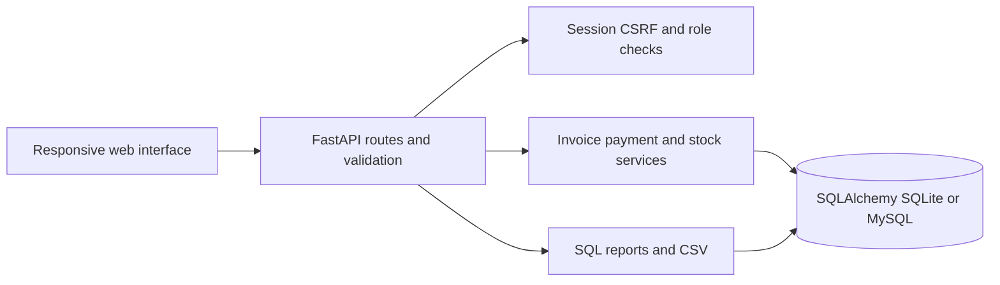
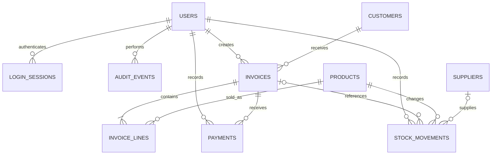

# Architecture and database relationships

The browser serves a static HTML/CSS/JavaScript interface. Requests go to FastAPI, which validates payloads with Pydantic. Service functions apply business rules using SQLAlchemy sessions. SQLite is the zero-configuration demo backend. The same models have a MySQL connection configuration and a Compose deployment.

## Transactions

Each API request has a session. The database dependency uses function scope so its transaction commits before the response is sent. An exception rolls back the complete operation.

MySQL stock-changing operations lock product rows using SELECT FOR UPDATE, sorted by identifier to keep the lock order consistent. Payment/cancellation operations lock the invoice before checking its current balance. SQLite has no equivalent row-level locking, so the demo uses BEGIN IMMEDIATE and a connection timeout, serializing its transactions.

Request IDs have unique constraints. Services compare a fingerprint of the normalized payload to the original fingerprint before treating a request as a retry. A concurrent uniqueness conflict rolls back and returns HTTP 409; retrying an identical request after the first transaction commits retrieves the existing result.

## Money and history

Price, cost, subtotal, discount, tax, payment and due are integer poisha. Inputs accept decimal BDT with no more than two decimal places. The frontend displays BDT. Invoice line prices and names are stored as snapshots, so catalog edits do not rewrite historical sales.

The stock ledger is append-only through the application. SALE movements remove quantity, RECEIVE/OPENING add it, ADJUST records a signed correction, and CANCEL adds back an unpaid sale's quantity. Balance-after is a historical value, not the current product stock.

## Authentication

Passwords are salted PBKDF2-SHA256 hashes with 310,000 iterations. The browser holds an HttpOnly, SameSite Strict session cookie. Only the token's SHA-256 hash is stored in the database. A separate CSRF token must be supplied for mutations. Origin checks reject foreign browser origins. Sensitive APIs are not cached. Authenticated role checks guard administrator operations.

This local portfolio build does not provide public-server rate limiting, password recovery, MFA, managed secrets, migrations or automatic backups. Keep it bound to localhost for the demo. Public hosting requires separate deployment work.
